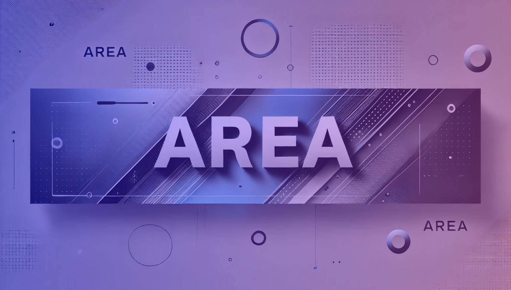

# AREA



##  📂 Project Concept

Welcome to the **Action-REAction** project!

An AREA is a fundamental module within the Action-REAction project, serving as an automation unit. Drawing inspiration from platforms like IFTTT and Zapier, an AREA enables you to connect a triggering action (Action) to a corresponding response (Reaction).

For example :

- Action: "Play music with Spotify"
- Reaction: “Send a notification on discord.”

AREAs act as connectors between various platforms or services, enabling users to design customized automations tailored to their specific needs.


## 🎯 Objectives

Develop a software suite consisting of:

1. **Application Server**: Implements all core logic.
2. **Web Client**: User interface accessible via a browser.
3. **Mobile Client**: User interface accessible via a smartphone.

The REST API server manages all processes, while the web and mobile clients only display data and forward requests.


## 📋 Features

- User registration and authentication (via OAuth2 or password).
- User management and administration.
- Subscription to third-party services (Google, Facebook, etc.).
- Creation of AREA zones linking actions to reactions.
- Management of triggers to automate actions.

## 🌍 Accessibility

This project is designed to be **inclusive** and **accessible** to everyone.  
It includes features to support users with:  
- 👁️ **Visual impairments**  
- 🎮 **Motor disabilities**  
- 🧠 **Cognitive disabilities**  

For more details, see the [Accessibility Guide](doc/Accessibility.md).  

## 🛠️ Technologies Used

This project uses the following technologies:

- **Node.js** for the back end 
- **MongoDB** for the database 
- **ReactJS** for the web front-end 
- **Expo** for the mobile front-end 
- **Docker** for containerization 
- **GitHub Actions** for continuous integration 

📊 **Want a detailed comparison?** Check out the [Comparative Study](doc/ComparativeStudy.md) for an in-depth analysis of these technologies.

## 🐳️ Setup with Docker Compose

The project includes three main services configured via `docker-compose`:

- `server`: Application server (port 8080).
- `client_web`: Web client (port 8081).
- `client_mobile`: Mobile client.

## 🚀 Run Project

### Prerequisites
- **Docker** and **Docker Compose** installed on your machine.
- `.env` file containing API keys and OAuth2 secrets like [this](doc/EnvFormat.md).

### Steps

1. **Clone the repository** :
   ```bash
   git clone git@github.com:EpitechPromo2027/B-DEV-500-BDX-5-2-area-thomas.gaboriaud.git
   cd B-DEV-500-BDX-5-2-area-thomas.gaboriaud

2. **Run docker:**

    ```bash
    docker-compose up

## 📖 Documentation

For detailed information about the project, please visit the [Documentation](doc/). 📚

---

## ✨ Authors

- [Raphaël Verrouil](https://github.com/raphvrl)
- [Thomas Gaboriaud](https://github.com/ThomasGaboriaud)
- [Tom Freida](https://github.com/TomFrda)
- [Raphaël Fouche](https://github.com/Raphael331100)
- [Mathieu Mayard](https://github.com/Mathieu17M)
