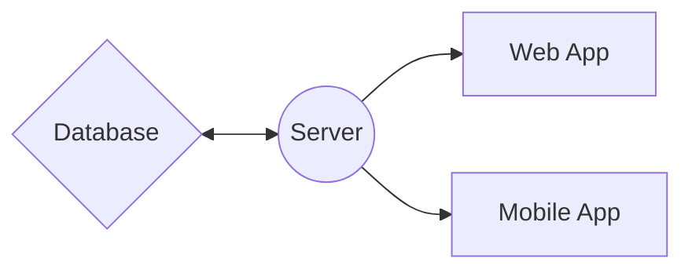

# 🌐 Relationships Between the Server, Web App, Mobile App, and Database

This document describes how the different parts of the **AREA** project interact with each other. The server plays a central role by handling requests from the web and mobile applications and interacting with the database.

## 📊 Relationship Diagram

---

## 🛠️ Interaction Details

### 1️⃣ Server (API) 🚀
The server is the **core** of the application. It exposes API endpoints that both the web and mobile applications use to interact with the system. The server manages business logic, authentication, and database interactions.

🔹 **Main Endpoints:**
- `/api/auth/github` → Authentication via GitHub.
- `/api/auth/spotify` → Authentication via Spotify.
- `/api/signUp` → User registration.
- `/api/signIn` → User login.
- `/api/setArea` → Create AREAs.
- `/api/deleteArea` → Delete AREAs.

---

### 2️⃣ Web Application 💻
The web application allows users to interact with the system via a browser. It sends requests to the server to retrieve or send data.

🔹 **Technologies Used:**
- **ReactJS** → User Interface development.
- **Axios** → HTTP requests to the server.

---

### 3️⃣ Mobile Application 📱
The mobile application provides a user interface for smartphones. It communicates with the server to perform similar operations as the web application.

🔹 **Technologies Used:**
- **Expo/React Native** → Mobile development.
- **Axios** → HTTP requests to the server.

---

### 4️⃣ Database 🗄️
The database stores all the necessary information for the application's functionality, including users, AREAs, and authentication tokens.

🔹 **Technology Used:**
- **MongoDB** → Data storage.

---

## 📋 Example Workflow

### 📝 User Registration
1️⃣ **Web/Mobile App:** The user fills out the registration form and submits the data.  
2️⃣ **Server (API):** The server receives the data, validates it, and creates a new user in the database.  
3️⃣ **Database:** The user's information is stored in **MongoDB**.  
4️⃣ **Web/Mobile App:** The user receives a confirmation of their registration.  

### 🔑 GitHub Authentication
1️⃣ **Web/Mobile App:** The user clicks the login button via **GitHub**.  
2️⃣ **Server (API):** The server redirects the user to **GitHub’s authentication page**.  
3️⃣ **GitHub:** The user authenticates, and GitHub redirects back to the server with an authentication code.  
4️⃣ **Server (API):** The server exchanges the code for an access token and stores the information in the database.  
5️⃣ **Database:** The authentication tokens are stored in **MongoDB**.  
6️⃣ **Web/Mobile App:** The user is logged in and can access application features.  

---

## 📄 Conclusion
This document provides an **overview** of the relationships between the different components of the **AREA** project. The **server** plays a central role in managing requests from the **web and mobile applications** and interacting with the **database** to ensure the proper functioning of the application. 🚀
